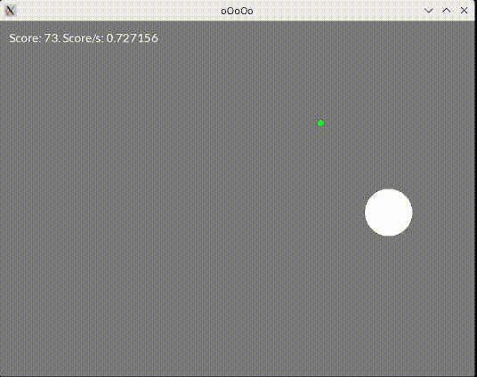

# Reinforcement Learning Sandbox

A lightweight reinforcement learning sandbox in C++17, designed to experiment with training agent policies in a 2D environment. It provides an abstract agent interface and a minimal 2D game environment to test learning strategies.

The focus of the project:
 - Gaining deeper understanding of reinforcement learning fundamentals
 - Creating a sandbox for experimenting with reinforcement learning algorithms in C++
 - Designing a layer of abstraction between what's rendered and actual environment state
 - Training a tabular Q-learning agent to play a game

# Trained agent

The demo game has three actions:
 - Up → sets the agent's vertical velocity.
 - Right → accelerates the agent to the right.
 - Left → accelerates the agent to the left.

The agent can bounce off left and right walls, allowing it to change direction faster than by deceleration alone. The agent successfully learns that strategy.

Negative reward is earned for touching bottom or top edge.
Positive reward is payed for the green points.

